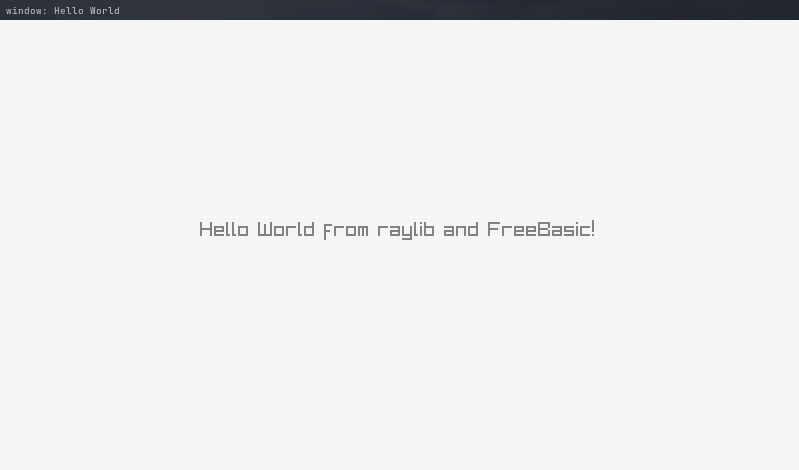

# raylib-freebasic -> v4.2

[FreeBasic](https://freebasic.net/) bindings for [raylib](https://github.com/raysan5/raylib)  
  
Lib | Linux | Windows | Mac | BSD |
--- | ----- | ------- | --- | --- |
raylib.bi | tested | tested |  not tested |  not tested
raymath.bi | tested | tested |  not tested |  not tested
raygui.bi | tested | not tested | not tested | not tested

## example
```basic
#include "raylib.bi"

Dim As Const Integer screen_width = 800
Dim As Const Integer screen_height = 450

InitWindow(screen_width, screen_height, "Hello World")
SetTargetFPS(60)

While Not WindowShouldClose()
	BeginDrawing()
		ClearBackground(RAYWHITE)
		DrawText("Hello World from raylib and FreeBasic!", 200, 200, 20, GRAY)
	EndDrawing()
Wend

CloseWindow()
```

  
  
    

## important
these are just bindings, so you must have raylib already on your computer  

the bindings were tested with raylib and raygui compiled separately as shared libraries  

for more info about building raylib visit [official wiki](https://github.com/raysan5/raylib/wiki)
and for raygui check [official repo](https://github.com/raysan5/raygui#building)


simple game i wrote that uses [raylib-freebasic](https://github.com/WIITD/asteroid_field/tree/raylib-freebasic)
